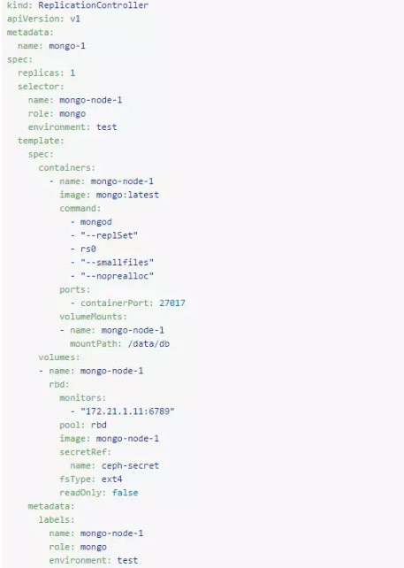
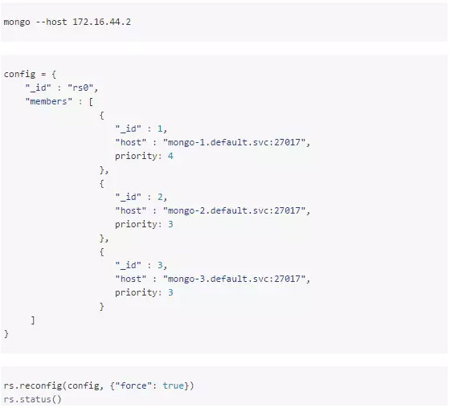

### HOW TO DEPLOY
1. IF you don`t want to enable the authtication please delete the args --auth in command: 

2. IF you want to enable the authtication do as follow
  > * if you migrate your data from old and old data has used the auth start it directly , ignore follow tips
  > * delete the args --auth in command:
  > * run the deployment and into shell: 
 
```
 EG: kubectl exec -it tsjr-mongo-cluster-64d59c9b97-gt67w -- mongo --shell docker-entrypoint-initdb.d/mongo-init.js
 PS: YOU CAN CHANGE YOUR PASSWORD IN K8S serect
```
  > * restart the deployment
  > * use you username and password to use

3. IF you want to backup data run the mongo-oncejob.yml
   + username and password in mongo-key.yml
   + dblist in mongodump-job-value.yml
 
 ### You can also create cronjob refer to yml of mysql
 
4. Create Cluster refer follow:
<p align="center"> </p>
<p align="center"> </p>

```
 rs.add("172.16.7.3")
 rs.remove("172.16.7.3:27017")
```
